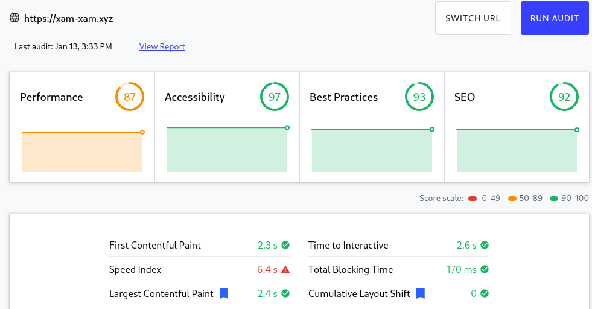

# Xam-xam smart application

## Description

Application that will give the possibility to an user to do create, update and delete storages to manage your food. Within these storages for food, food will be able to be added, updated and deleted. The attributes for food are the name, amount, expiration date and the type of food that it is.

## Technologies

### Backend

I am going to use the rust as the backend language. For the web framework I am going to use actix. As a database I am going to use mysql or postgresql, and the ORM to manage these will the the diesel ORM. To send emails for recovery codes i am using mailgang, a mini library I wrote that uses sparkpost api to send emails. For the authentication I am using JWT tokens. For the password recovery and other token codes are stored inside a redis memory-database.

I am going to try to separate the authentication and user related task and business sides in 2 micro-services. These 2 microservices will be wrapped into a docker image so to easily ship them.

### Frontend

For the frontend I am using nginx to serve my react application. I will use the service worker to cache static files and control internet access. If the app is offline it will send a json object which will make the app aware it is offline and warns the user about it.

## Scope

### In-scope

Design of the style of the application, rust backend and databases. Information for storages that will be stored are the name and type of the storage. Information for food that is stored in storages, the following attributes are stored these are the name, amount, expiraton date and the type of food. Project that shows where the bad products are and not their state.

### Out-scope

Other values, like the nutritive values for the food are not registered in the database.

## Services

For this project I am going to try to seperate the small monolith into microservices. My nginx and my microservices all enable compression(Gzip) for their requests to make transferring lighter. The microservices because off their size will only pool 1 connection to their respective data sources(Postgresq, Redis). If scaling is needed you can tune the service which is loaded a lot.

### Diagram

### Authentication service

This service will manage the user side of the application. This means:

* Registrations of users.
* Login: will attach a private cookie(JWT token).
* Confirming email.
* Changing email if logged in, if they are a confirmed user.
* Changing password if logged in, if they are a confirmed user.
* Logging out users.
* Showing the 5 oldest products, and also showing their storage where there stored at.
* Sending email with a token for users who forgot their password, this token will be in a redis database and expire.

### Business service

This service will manage business related side of the application, this will only accept and execute requests with a valid JWT. The following things are done by this service:

* CRUD operations of storages.
* CRUD operations of products.

### Frontend service

Service used to serve react app to the users. Will also reroute http requests to https. The served app will be a web app that will use the SPA framework React. The application will also be a PWA that can be loaded offline through the use of service workers who will cache static assets and warn the user through toast-like notification if it the app doesn't have connectivity.

### Postgres

Database that is used to store all the data that is permanent. This will be secured by a password that the microservices will incorp in their connection strings for security.

### Redis

Database that temporarily stores the tokens needed to create a user, change their email or is used for passwords that the user forgot to reset these. These tokens will after a time not be good anymore, the time out will be after 10 minutes. The redis database will also be secured with a password.

## Deployment

When the app is going to be deployed in production there are 2 scenario's that will be dealt with the inital deployment of the application, the initial deployment and the update of the application. I wrote 2 bash scripts build and setup that will facilitate deployment and building of the project.

### Initial deployment

This is when you need to deploy the application from scratch, I will describe here under fairly general steps to achieve the deployment.

1. Acquire a linux vps, preferred a Debian based.
2. Acquire a domain.
3. Link the ip address to the domain so traffic of the url is routed to you're vps.
4. On the vps install docker, docker-compose and certbot.
5. Use certbot to generate SSL certificates and configure the time on the vps this is important to get correct certificates.
6. Pull the smartapp project from Github in a directory setup specially for production.
7. In the production directory write the Jwt.toml file and setup the correct JWT parameters in accordance to your wishes.
8. Modify the dockerfile of the frontend react app to modify the api url's in the environmental variables.
9. In the production directory write the docker-compose.yml file, fill in the template and set it in the production directory and not in the smartapp directory. This file need to be filled in to configure the different volumes and credentials you want to set in the apps.
10. Execute the setup.sh script to build and deploy the app, give in it also the path to your docker-compose.yml production file and Jwt.toml used for authentication.
11. Test the app and troubleshoot problems.
12. Enjoy the application.

### Update of the application

1. Go on the VPS and go into the smartapp directory and pull all the changes from github.
2. Execute the setup.sh script to build and deploy the app, give in it also the path to your docker-compose.yml production file and Jwt.toml used for authentication.
3. Test the app and troubleshoot problems.
4. Enjoy the application.

## What I have learned

* The web framework actix.
* I have deepened my knowledge of the programming language Rust.
* Using SSL certificates and certbot to encrypt traffic to and from servers.
* Understanding and learning of JWT tokens and private cookies to put them in.
* Understanding the rust ORM(diesel) to communicate with a postgres database.
* Learning to use the nginx web server, to server content and to reroute to https automatically(important for service workers).
* Learning about Gzip compression for request to reduce bandwidth.
* Containerizing react apps, rust microservices.
* Deploying a complete applications with docker-compose.
* Learning to use the SMTP server to send emails.
* Learning to use a redis database to store temporary tokens.
* Building a react application and using toasts to show messages to users.

## Maintaining the application

The maintenance of the app is pretty extensive because there is a lot off to maintain, the docker files and application code. These are the things where you should pay attention to:

* Try to optimize the docker images and always test extensively that they correctly work. Because off the isolated nature of docker and their filesystem, you should test and optimize the images you make.
* Make sure the service worker includes the correct static assets, prefer using node.js to maintain and update css and js dependencies this makes it faster and more simpel to do.
* Always optimize the final build artifacts when deploying, this means as light as possible binaries or static assets and less possible debugging symbols or code.
* If you want to add more microservices make sure it is deployed in the right order in the docker-compose file or you could make it crash due to not being able to connect itself to a database.
* Make sure that the react app controls on user input, on the backend it is already the case with the database and serialization format. But controlling the user input on the app will increase user experience.
* Make sure you backup regularly the database, through cron jobs or other means.

## Extending the application

Even if the application has for the moment a good amount of features. These are the things I would do:

* Asyncify the orm and redis database connection library, the web server on http level is already asynchronous but the data layer is not, this is important so that the the server doesn't block on 1 statement that may need a lot of time to complete.
* Asyncify the fetch within the application through code re-write or using a library like axios to handle this for us.
* Using icons for storages and food in their dialogs and lists to be more readable.
* Write ansible playbooks to maintain the vps where the app is running to automate and win time on configuration.
* Use nginx as reverse proxy to all the api, this will make it seem that all requests come from 1 server this is a nice-to-have security feature. Ensures with this method that all request through the proxy are compressed and encrypted.
* Make the app more scalable by modifying the docker-compose file to replicate instances of services.

## Challenges and errors

This is a listing of a series of problems I had while deploying my app for the 1st time and the challenges I had and how I solved them.

### Deployment problems

Errors I had while deploying:

* Cannot deploy a volume on the root of a container.
* Cannot deploy a container whose port is already being listened to.
* Rust build of the authentication service fails on my vps but not on my linux desktop.
* Rust building of Authentication service error message:
*process didn't exit successfully: rustc --crate-name xam_xam_id_web --edition=2018 src/main.rs --error-format=json --json=diagnostic-rendered-ansi --crate-type bin --emit=dep-info,link -C opt-level=z -C panic=abort -C lto -C codegen-units=1 -C metadata=1de7fef8615bf336 -C extra-filename=-1de7fef8615bf336 --out-dir /xam-xam-id-web/target/release/deps -L dependency=/xam-xam-id-web/target/release/deps --extern actix_cors=/xam-xam-id-web/target/release/deps/libactix_cors-d9df84cc0c22cf5b.rlib --extern actix_identity=/xam-xam-id-web/target/release/deps/libactix_identity-679ab82e63f83f3d.rlib --extern actix_web=/xam-xam-id-web/target/release/deps/libactix_web-02e91e66f8948eb7.rlib --extern actix_web_httpauth=/xam-xam-id-web/target/release/deps/libactix_web_httpauth-a31192eda17bb5b4.rlib --extern futures_util=/xam-xam-id-web/target/release/deps/libfutures_util-51c5483afad7606b.rlib --extern jwt_gang=/xam-xam-id-web/target/release/deps/libjwt_gang-ef8c9d7b564d53ef.rlib --extern log=/xam-xam-id-web/target/release/deps/liblog-9f954c959ce6348b.rlib --extern log4rs=/xam-xam-id-web/target/release/deps/liblog4rs-561ae4aa8ca33383.rlib --extern mailgang=/xam-xam-id-web/target/release/deps/libmailgang-c317905a00803e87.rlib --extern rustls=/xam-xam-id-web/target/release/deps/librustls-02e9145bfe52ad91.rlib --extern xam_xam_common=/xam-xam-id-web/target/release/deps/libxam_xam_common-378dec558d999979.rlib --extern xam_xam_id_bll=/xam-xam-id-web/target/release/deps/libxam_xam_id_bll-ee123005831b19df.rlib -L native=/xam-xam-id-web/target/release/build/ring-287f767d5dbcec7c/out -L native=/xam-xam-id-web/target/release/build/brotli-sys-69dd56223ff5bb19/out -L native=/usr/lib/x86_64-linux-gnu (signal: 9, SIGKILL: kill)*

* Another docker compose error linked to SSL certificates: *error while loading shared libraries: libssl.so.1.1: cannot open shared object file: No such file or directory*

* Make sure you map correctly ports to the ports of your api.
* Make sure the smtp domain that you configure is right, an error I overlooked quite easily.
* Make sure you ca certificates are there or you will get the next error: *error:1416F086:SSL routines:tls_process_server_certificate:certificate verify failed:../ssl/statem/statem_clnt.c:1245: (unable to get local issuer certificate)*
* Make sure that the timezone and ntp server is okay on your VPS to not get certificate errors.

### Challenges

Challenge | Solution or workaround
---|---
Error in Firefox about certificates not being valid.| The problem was that the time on the vps that the docker containers used was wrong, I then modified my timezone to match Europe/Brussels.
SSL error when building a rust microservice for not having root certificates in the container.| Install root certificates so that it can validate its own SSL certificats.
SSL library was missing when build a rust microservice.| Install the ssl certificates in the docker container.
Building of the rust microservice for authentication failed.| I managed to create a workaround by reducing the amount of build flags I give through. I removed the LTO flag and codegen-units.
Sparkpost account with which I wanted to send emails rejected my domain xam-xam.xyz.| To work around this and not wast time I just used a google account to send out emails.
Could not link host os and docker directory to share files.| I looked up at the documentation of docker-compose to share both individual files and directories.