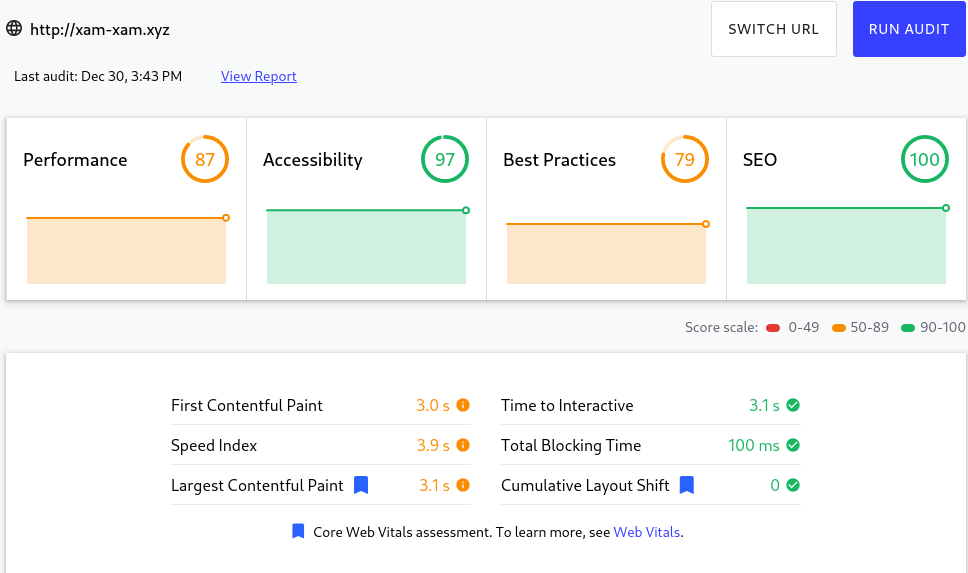

# Xam-xam smart application

## Description

Application that will give the possibility to an user to do create, update and delete storages to manage your food. Within these storages for food, food will be able to be added, updated and deleted. The attributes for food are the name, amount, expiration date and the type of food that it is.

## Technologies

### Diagram

### Backend

I am going to use the rust as the backend language. For the web framework I am going to use actix. As a database I am going to use mysql or postgresql, and the ORM to manage these will the the diesel ORM. To send emails for recovery codes i am using mailgang, a mini library I wrote that uses sparkpost api to send emails. For the authentication I am using JWT tokens. For the password recovery and other token codes are stored inside a redis memory-database.

I am going to try to separate the authentication and user related task and business sides in 2 micro-services. These 2 microservices will be wrapped into a docker image so to easily ship them.

### Frontend

For the frontend I am using nginx to serve my react application. I will use the service worker to cache static files and control internet access. If the app is offline it will send a json object which will make the app aware it is offline and warns the user about it.

## Scope

### In-scope

Design of the style of the application, rust backend and databases. Information for storages that will be stored are the name and type of the storage. Information for food that is stored in storages, the following attributes are stored these are the name, amount, expiraton date and the type of food. Project that shows where the bad products are and not their state.

### Out-scope

Other values, like the nutritive values for the food are not registered in the database.

## Services

For this project I am going to try to seperate the small monolith into microservices. My nginx and my microservices all enable compression(Gzip) for their requests to make transferring lighter. The microservices because off their size will only pool 1 connection to their respective data sources(Postgresq, Redis). If scaling is needed you can tune the service which is loaded a lot.

### Authentication service(Rust actix-web)

This service will manage the user side of the application. This means:

* Registrations of users.
* Login: will attach a private cookie(JWT token).
* Confirming email.
* Changing email if logged in, if they are a confirmed user.
* Changing password if logged in, if they are a confirmed user.
* Logging out users.
* Showing the 5 oldest products, and also showing their storage where there stored at.
* Sending email with a token for users who forgot their password, this token will be in a redis database and expire.

### Business service(Rust actix-web)

This service will manage business related side of the application, this will only accept and execute requests with a valid JWT. The following things are done by this service:

* CRUD operations of storages.
* CRUD operations of products.

### Frontend service(Nginx)

Service used to serve react app to the users. Will also reroute http requests to https. The served app will be a web app that will use the SPA framework React. The application will also be a PWA that can be loaded offline through the use of service workers who will cache static assets and warn the user through toast-like notification if it the app doesn't have connectivity.

### Postgres

Database that is used to store all the data that is permanent. This will be secured by a password that the microservices will incorp in their connection strings for security.

### Redis

Database that temporarily stores the tokens needed to create a user, change their email or is used for passwords that the user forgot to reset these. These tokens will after a time not be good anymore, the time out will be after 10 minutes. The redis database will also be secured with a password.

## Deployment

When the app is going to be deployed in production there are 2 scenario's that will be dealt with the inital deployment of the application, the initial deployment and the update of the application. I wrote 2 bash scripts build and setup that will facilitate deployment and building of the project.

### Initial deployment

This is when you need to deploy the application from scratch, I will describe here under fairly general steps to achieve the deployment.

1. Acquire a linux vps, preferred a Debian based.
2. Acquire a domain.
3. Link the ip address to the domain so traffic of the url is routed to you're vps.
4. On the vps install docker, docker-compose and certbot.
5. Use certbot to generate SSL certificates and configure the time on the vps this is important to get correct certificates.
6. Pull the smartapp project from Github in a directory setup specially for production.
7. In the production directory write the Jwt.toml file and setup the correct JWT parameters in accordance to your wishes.
8. Modify the dockerfile of the frontend react app to modify the api url's in the environmental variables.
9. In the production directory write the docker-compose.yml file, fill in the template and set it in the production directory and not in the smartapp directory. This file need to be filled in to configure the different volumes and credentials you want to set in the apps.
10. Execute the setup.sh script to build and deploy the app, give in it also the path to your docker-compose.yml production file and Jwt.toml used for authentication.
11. Test the app and troubleshoot problems.
12. Enjoy the application.

### Update of the application

1. Go on the VPS and go into the smartapp directory and pull all the changes from github.
2. Execute the setup.sh script to build and deploy the app, give in it also the path to your docker-compose.yml production file and Jwt.toml used for authentication.
3. Test the app and troubleshoot problems.
4. Enjoy the application.