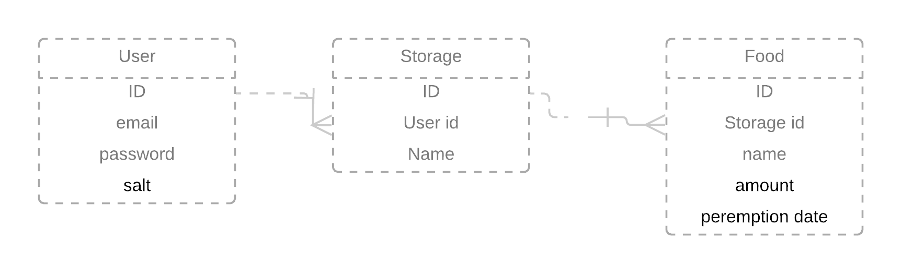

# Xam-xam smart application

## Description

Application that will give the possibility to an user to do create, update and delete storages for food. Within these storages for food, food will be able to be added, updated and deleted.

The attributes for food are its name, the number of it and it peremption date. Following the peremption date it will show the food products in the colors:

* Red: Peremption date is over the today's date.
* Yellow: The date of today and the peremption date are the same.
* Green: Peremption date is not over today's date.

## Models

## Technologies

### Backend

I am going to use the rust as the backend language. For the web framework I am going to use actix. As a database I am going to use mysql or postgresql, and the ORM to manage these will the the diesel ORM. To send emails for recovery codes i am using mailgang, a mini library I wrote that uses sparkpost api to send emails. For the authentication I am using JWT tokens. For the password recovery codes are stored inside a redis memory-database.

I am going to try to separate the authentication and user related task and business sides in 2 micro-services. These 2 microservices will be wrapped into a docker image so to easily ship them.

### Frontend

For the frontend I am using nginx to serve my react application. I will use the service worker to cache static files and control internet access. If the app is offline it will send a json object which will make the app aware it is offline and warns the user about it.

## Scope

### In-scope

Design of the style of the application, rust backend and databases. The only attribute that will hold accountable is the peremption date. Project that shows where the bad products are and not their state.

### Out-scope

Other values, like the nutritive values are not registered in the database.